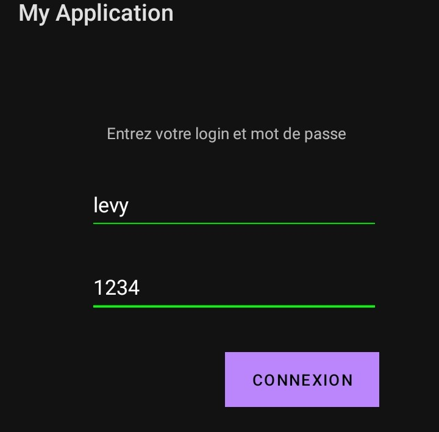

# TP2
#Réalisé par Emmanuel Levy MBINA 
#Created by Emmanuel Levy MBINA

Une application android de gestion de service téléphonique.
Elle permet à l'utilisateur de se connecter, d'effctuer des appels et de recharger son compte depuis l'application.
Elle détécte également l'opérateur de l'utilisateur et peut donc définir de façon automatique le code pour la recharge du compte et la consultation du solde.
Ces opérations étant considérés comme des appels , elle doit au préanle obtenir l'autorisation de passer des appels.


A telephone service management android application.
It allows the user to connect, make calls and recharge their account from the application.
It also detects the user's operator and can therefore automatically define the code for recharging the account and consulting the balance.
These operations being considered as calls, it must first obtain authorization to make calls.




```bash
ls
ls


jjd
```


fferer
